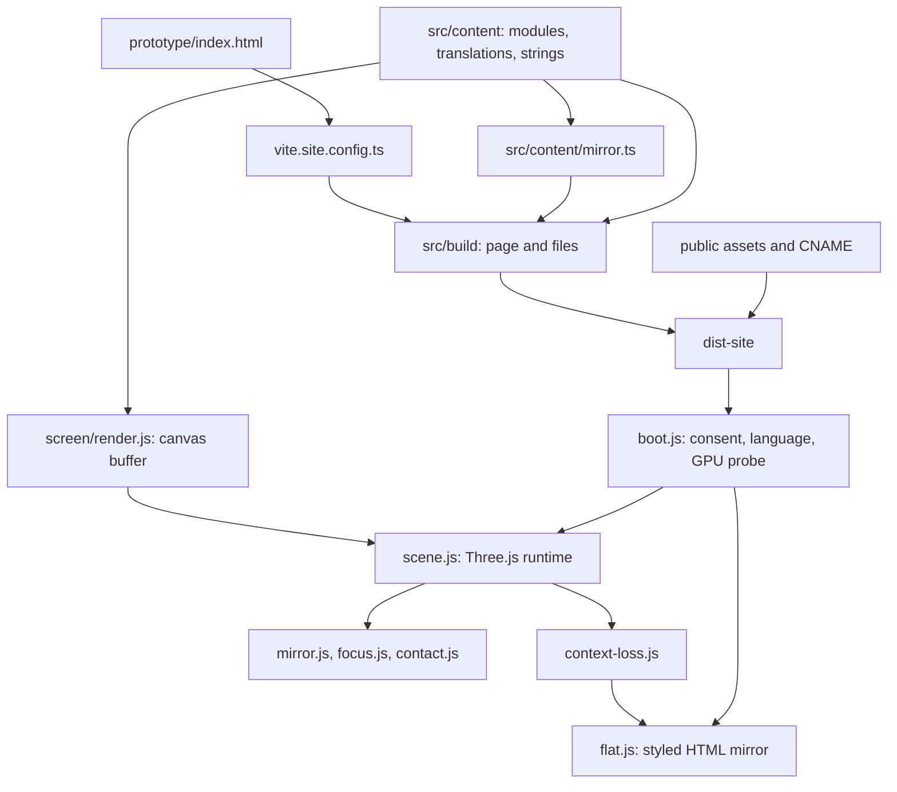
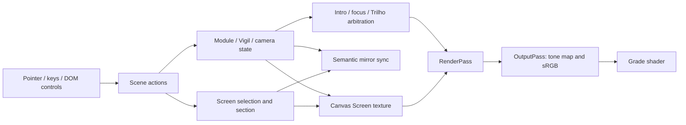

# Current architecture

Inspected 2026-09-15 at local `lyra` HEAD `46bf5e9`, including pre-existing uncommitted room/assets work. This describes the working tree, not a verified live deployment. No runtime behavior was changed by the documentation bootstrap.

## System and entry points

Tenebrae presents six portfolio Modules through an interactive Three.js instrument. A semantic HTML mirror shares the same content; a styled flat view provides a no-GPU route. Portuguese `/` and English `/en/` are generated from one page source. This is a static frontend with external contact/analytics services, not a React SPA or server application.

The separate root `index.html` → `src/main.tsx` → `src/App.tsx` renders an empty `<main id="unit">`. `vite.config.ts` configures that React shell and Vitest. `vite.site.config.ts` configures the real site. React's presence in dependencies does not establish ownership of the production DOM.

## Lifecycle, state and rendering

1. Built HTML already contains localized metadata, portfolio mirror and discovery links. `prototype/index.html` supplies frame layout, accessible controls, fonts and consent-gated GTM loading.
2. `boot.js` creates consent UI and sequences the language offer, then probes capability before importing `scene.js`. `?flat` forces the flat path; this ordering avoids constructing a renderer on an unsuitable device.
3. Importing `scene.js` constructs renderer, scene, camera, instrument/room, textures, DOM adapters and input listeners at module scope. Construction order matters; callbacks such as mirror/camera guards are wired during setup.
4. `screen/render.js` owns a 320×180 canvas buffer and mutable selection/section/display state. `scene.js` owns active Module, Vigil, interaction and camera state. There is no centralized store library. Coordinating actions call Screen setters, repaint textures and synchronize the semantic mirror.
5. Pointer, touch, keyboard and DOM controls converge on existing actions such as `pressPad` and `screenHitEm`. Portrait touch mode rotates the frame; coordinate conversion must precede hit testing. Camera updates are shared by intro, focus, Trilho and debug/freecam paths, with guards to avoid competing writers.
6. A continuous rAF loop advances controls, lighting, Screen/portrait state, intro/focus/travel, then renders through post-processing. Screen texture updates have a separate 24 Hz cap. Geometry and canvas artwork also have standalone workbenches. `window.__unit` exposes inspection, stepping, quality and performance helpers.
7. Context loss switches to `flat.js`, which reveals/styles the shared mirror. An explicit scene-wide teardown/cancel path was not found; switching visible UI is not proof that listeners, GPU resources and animation work are released. This needs runtime investigation (TASK-002).

`post.js` supports optional bloom inserted before OutputPass and removed/disposed when disabled; it is off by default. The grade includes vignette/grain and optional lo-fi processing. Renderer quality starts at `min(devicePixelRatio, 1.5)`; composer resolution must follow quality changes.

## Module boundaries

| System | Main files | Contract / coupling |
| --- | --- | --- |
| Content | `src/content/modules.ts`, `en.ts`, `locale.ts`, `strings.ts` | Six Modules and Works; locale resolved for runtime imports; all consumers share data |
| HTML truth | `src/content/mirror.ts`, `prototype/mirror.js` | Same renderer used at build/runtime; runtime adopts pre-rendered mirror and connects navigation |
| Page assembly | `src/build/page.ts`, `files.ts`, `vite.site.config.ts` | Metadata, translations, base URL, sitemap/robots/llms output |
| Instrument | `scene.js`, `plate-art.js`, `control-faces.js`, `deck-faces.js`, `screen/*` | Procedural geometry/artwork, shared proportions, hit testing and state |
| Room | `room-baroque.js`, `room-decor.js`, `room-mobilia.js`, `altar-props.js` | Shared world scale, placement, lighting, asynchronous local models |
| Navigation | `trilho.js`, `public/quarto/trilho.json`, `intro.js`, `focus.js` | Camera authority and shared state must be coordinated in `scene.js` |
| Work presentation | `focus.js`, `summon.js`, `works-art.js`, `sleeve-art.js` | DOM case view, scenery and transitions consume Works; `sleeve-art.js` was untracked at inspection |
| Light/render | `light.js`, `chama.js`, `post.js`, `scene.js` | Vigil, visible light count, shadows, shader variants and pixel ratio |
| Fallback | `capability.js`, `context-loss.js`, `flat.js`, `flat-skin.js` | Initial capability and later failure; mirror remains content source |
| Services | `contact.js`, `consent.js`, `track.js`, `language.js` | User interaction, external submission, consent and browser storage |

## Design and assets

Styling is distributed: page CSS in `prototype/index.html`, CSS strings in DOM modules, CSS variables in `flat-skin.js`, and canvas palettes/fonts in `screen/render.js`. There is no shared component/token framework. The visual language uses engraved controls, dark materials, gold/bone/ember tones, blackletter and pixel/monospace display typography. Google Fonts are loaded by the page; local asset paths and font loading affect visual fidelity.

The instrument remains code-generated. Furniture/models/textures live under `public/mobilia/` with licensing in `CREDITS.md`; Draco/GLTF loading is in `room-mobilia.js`. World-scale conversion and furniture positions interact with camera poses and room geometry. `asset.js` resolves general public assets; some loaders retain local path helpers. Preserve locale/subdirectory resolution when touching them.

The flat view scrolls normally. The 3D frame rotates on portrait coarse-pointer devices; body-mounted contact, consent and mirror avoid rotating text entry. Canvas controls have DOM counterparts. Accessibility depends on their shared state, focus behavior and mirror visibility; a static HTML check does not establish complete accessibility.

`viewport-ui.js` observes the body notice stack and touch toolbar once at boot. CSS maps measured notice occupancy to the frame's bottom or rotated right edge; renderer dimensions and camera poses remain unchanged. The default visor is bounded by available frame width/height, and its input helper inverts the portrait quarter-turn before invoking existing Screen actions. The Work reader mounts directly in `#frame`, above sibling HUD/touch controls; its arrows anchor to the already-inset reader panel. Contact remains body-mounted with notice-aware height; flat mirror bottom padding allows scrolling Write above notices. See [ADR-033](DECISIONS.md#adr-033--reserve-notice-space-in-dom-frame-coordinates).

## Services and deployment

- Web3Forms: browser POST in `contact.js`; success requires an OK response and `body.success`. Contact now bounds fetch and body consumption with a 15-second deadline and AbortController (TASK-004). Dismissal cancels local waiting, preserving the draft; timeout/cancellation cannot establish whether remote delivery occurred. Each attempt owns its result, and stale completions/timers cannot alter a newer session. The public access key is intentional (ADR-0030); this is not a secret backend credential.
- GTM: host-gated loader in page HTML, enabled after saved/current consent. `track.js` supplies event payloads; browser storage remembers consent/preferences. Container/GA configuration outside this repository was not audited.
- Optional environment probes in `scene.js` and model/font/texture loading can fail independently of compilation. Inspect the actual network in runtime reviews.
- GitHub Actions `.github/workflows/pages.yml`: push to `lyra` or manual dispatch → Node 22 / npm ci → Vitest → typecheck → build:site → verify:site → upload `dist-site` → Pages. `public/CNAME` carries the domain. Live deployment, DNS, analytics and form delivery were not tested in this bootstrap.

The site build runs locale generation in a post-ordered `generateBundle` hook. Each locale starts from the same Vite-produced HTML. `/en/` gets an early `<base href="../">` for both markup and runtime assets. Manually copying a page or rewriting individual URLs creates a second source of truth.

## Verification and observed risks

On 2026-09-15: `npm run check`, `npm test` (7 files / 153 tests), `npm run typecheck`, `npm run build:site`, `npm run verify:site` all passed. Static verification found six Modules and 22 rows in each locale. No browser/GPU, real-device, accessibility, contact submission or live-site verification was performed.

TASK-004 subsequently added 13 mocked Contact regressions (166 tests total). All five integration checks and independent code review passed. Built Chrome checks exercised both languages, 3D/flat paths, desktop/mobile emulation, focus boundaries, pending dismissal, actual 15-second timeout, network failure, success and reopen races with intercepted requests only. The contact dialog traps focus while open, becomes inert on close, and restores its connected opener. Real-device keyboards, screen readers and actual delivery remain unverified. See [Contact plan and handoff](docs/planning/contact-reliability.md).

- **Coupled runtime:** `scene.js` is about 7,300 lines, with module-scope side effects and shared camera/state writers. Successful bundles cannot detect initialization, geometry or interaction errors.
- **Coverage boundary:** TypeScript covers `src/` and default Vite config, not shipping JS or site config. Vitest uses jsdom. No browser E2E or lint setup was found. `verify:site` checks static output but does not assert `CNAME` presence.
- **Development fallback:** mirror pre-rendering runs during `generateBundle`, while `flat.js` requires an existing mirror. The raw dev server's forced/no-GPU path may therefore differ from the built site; this is a source-based finding, not a browser-confirmed failure. Verify fallback against the production artifact.
- **Load/performance:** this working-tree build warned at ~1,019 kB minified / 289 kB gzip for the scene chunk (900 kB warning threshold). `public/` occupied ~28 MiB on disk, including ~16 MiB of furniture; disk totals are not transfer sizes or first-load measurements. No new frame-rate measurement was made. Heavy lights, shader variants, texture uploads, post passes and resource lifetime deserve measurement before expansion.
- **Multiple representations:** Screen, mirror, flat view and focus panel share content but have separate presentation/state adapters. Content and translations must change together. Existing grid/node item caps remain an overflow concern (T-16).
- **Documentation drift:** HANDOFF and the ticket board contain outdated state; the issue-tracker guide still says there is no remote. Older comments describe replaced behavior. The latest room exploration map is an approved target that differs from current `?trilho` behavior.
- **Isolation risk:** the current tree has unfinished tracked and untracked room work. A worktree from HEAD alone will omit it. Existing content/room branches cannot be assumed integrated or disposable.

Keep the current stack: plain JS/DOM and Three.js already serve the experience. A React migration, global state framework or renderer rewrite would increase scope without evidence that it solves a requested problem.

TASK-005 subsequently added four coordinate/occupancy tests (170 total). Five integrated checks and independent source review passed. Seven built Chrome scenarios covered PT/EN, portrait/landscape, desktop, flat, forced rotation and experimental room mode. Touch interaction checks covered default-visor project selection, image navigation, scrolling and Back, including 320px width. Software-rendered camera transitions used existing deterministic stepping where needed; this is not a frame-rate measurement. No live delivery, deployment, real-phone keyboard/safe-area or screen-reader verification occurred. See [mobile handoff](docs/planning/mobile-usability.md#handoff).

### Default/room Work target boundary (T-38)

Work opening resolves a wall sleeve only when `ROOM_K > 0`; ordinary instrument mode clears the sleeve target and uses the Screen pose. Room code remains preserved but is not permission to redirect the default experience into hidden scenery. This corrects a preexisting working-tree boundary error; it does not establish a mobile performance fix. See TASK-006/007.
